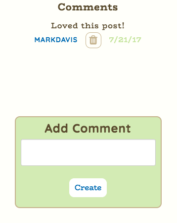

# GA WDI London: Project 4

## Guideblog

Guideblog is a mobile-first app with a Ruby on Rails API Back End and an Angular Front End. It was built by [Mark Davis](https://github.com/markjdvs) & [Omar Harvey-Phillips](https://github.com/omaotzu).

### User Journey

This app provides a platform for users to plan trips based on interesting and popular blog posts from various areas of the world. Clusters of blog posts on different 'stops' (locations) provide a detailed and real impression of the local areas mentioned in these posts. Posts can be up or down-voted if they are deemed use(ful/less) by other users with popular posts being pushed up the 'worldblog' post feed. Various factors are provided by the blogger such as value for money, nightlife, culture and hospitality, allowing different users to find places that meet their preferences for a trip.

The worldblog page is available to any user, even unregistered ones, and displays all blog posts from all over the world. By clicking on specific areas, the specific posts associated with that cluster are displayed beneath. These are also sorted by popularity, voted for by other users who found them useful or a better reflection of the location.

A user needs to login in order create a trip and contribute to the app.

Going to a particular trip's page allows the user to begin adding stops to their journey. Previously, this is where the user could search for flights between different stops, providing further information and a more in-depth planning of their trip. However, due to the deprecation of the Skyscanner API, I have had to remove this. In the future, I will try to implement the [Rome2Rio API](https://www.rome2rio.com/documentation/).

We can then add our own posts to any city or other location along our trip and provide local information on it.

This is also where posts can be voted for depending on their popularity to highlight the posts that *truly* paint a more real picture of the location.

The post creator can upload personal images from during their time there and other users can comment on the post, connecting users of similar preferences with posts that meet those.

### Build & Technologies Used

- This app is built with a [Ruby on Rails](http://api.rubyonrails.org/) back-end, that serves an API that's consumed by our client-side [Angular](https://angularjs.org) app.

- [PostgreSQL](https://www.postgresql.org/) is used as our database.

- Images are base64 encoded and stored using the [AWS S3 service](https://aws.amazon.com/s3).

- [JWT](https://jwt.io) is used with [Satellizer](https://github.com/sahat/satellizer) for authentication, and [bcrypt](https://www.npmjs.com/package/bcrypt) for password hashing.

- [UI Router](https://github.com/angular-ui/ui-router) is our chosen single page application routing framework.

- [UI Bootstrap](https://github.com/angular-ui/bootstrap) is used to provide grid layouts and additional functionality including Modals.

- Styles are written in [SASS](http://sass-lang.com/documentation/file.SASS_REFERENCE.html) and [Gulp](https://github.com/gulpjs/gulp/blob/master/docs/API.md) is used as a taskrunner.

- We used [Babel](https://babeljs.io) to compile to ES5.

- The [Skyscanner API](https://partners.skyscanner.net/travel-apis/) was used to provide live flight details between different stops during a trip, however this API has now been deprecated so I've removed this option.

- [Google Places](https://developers.google.com/places/) autocompletes users' inputs and provides locational data on stops whilst [Google Map Clusters](https://developers.google.com/maps/documentation/javascript/marker-clustering) group blog posts in close proximity to one another on the worldblog page.

* The app is deployed via Heroku. [Try it here.](https://guideblog.herokuapp.com/)
